## {.center}

<p style="font-size: 1.3em;">When AI-generated text goes straight to users, how do you know whether it is good?</p>

::: {.notes}
With traditional apps, you can measure quality deterministically — response time, error rates, status codes, etc. But when the output is AI-generated, none of that tells you whether the content is actually good. Quality is subjective. So how do you know that the GenAI content that you're putting out into the world is achieving its purpose? You know by measuring...
:::

## {.center data-transition="none"}

<p style="font-size: 1.8em;">**User feedback.**</p>

::: {.notes}
User feedback. A lot of GenAI apps already collect this. As a user, you can probably think of a time you used a GenAI tool or chatbot or something, and it asked you to give a thumbs up or thumbs down to the response. So why not...
:::

## {.center data-transition="none"}

<p style="font-size: 1.3em;">Roll out an application change based on whether your users **prefer it**</p>

::: {.notes}
... roll out an app change based on whether your users prefer it? If user feedback is the only reliable signal, then use it to drive deployment decisions.
:::

# Live Demo {.center}


::: {.notes}
But you don't have to take our word for it. Let's jump right in and do a live demo of an application rollout based on user feedback. At first, most of you will receive an older version of an app that tells a story in 5 parts. We're rolling out a version that we think you'll like better. But it will only roll out if you upvote it.
:::

## Do the thing!

You're about to read a short AI-generated story.

After each part, vote: **thumbs up** or **thumbs down**.

That's it. Just read and react.


::: {.notes}
:::

## Time to Vote! {.center}

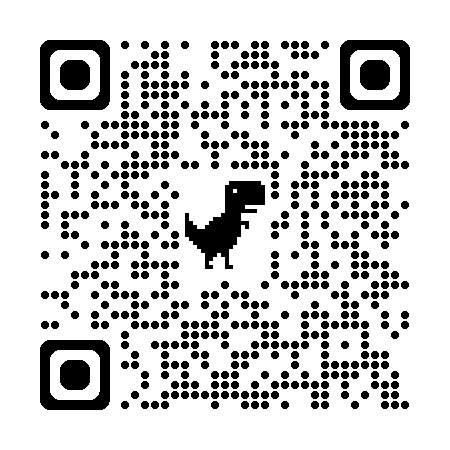{width=400}

Read each story part. Vote thumbs up or thumbs down.

::: {.notes}
The application change is rolling out over 4 minutes or so. Every 30 seconds Flagger evaluates whether the new version is performing better than the old version, and if so, it sends more traffic to the new version. If you don't know Flagger, don't worry, we'll talk more about it later.
:::

## [Live Dashboard](https://app.datadoghq.com/dashboard/68y-xeg-j6s) {.center}

Watch the votes come in:

**[Open Datadog Dashboard](https://app.datadoghq.com/dashboard/68y-xeg-j6s)**

::: {.notes}
:::

## Did you figure out the **two versions** of that story? {.center}

::: {.notes}
Did you put it together?
:::

## {.center data-transition="none"}

Variant A had a more boring tone.

::: {.notes}
The original app, Variant A, told the story in a straightforward, matter-of-fact manner.
:::

## {.center data-transition="none"}

Variant B had a more playful tone.

::: {.notes}
And the prompt of the app we rolled out — Variant B — instructed the LLM to write a funny and playful story.

So we essentially pitted one prompt against an updated prompt.
:::

## {.center data-transition="none"}

<p style="font-size: 1.3em;">So we talked about how the right **trace data** gets into the collector...</p>

::: {.notes}
So we talked about how the right **trace data** gets into the collector...
:::

## {.center data-transition="none"}

<p style="font-size: 1.3em;">The platform **shifted traffic** toward the variant you liked more.</p>

::: {.notes}
:::

# The App {.center}

::: {.notes}
Let's talk about what's going on at the app-level that helps to enable this.
:::

## Full Architecture {data-transition="none"}

```{mermaid}
%%| fig-width: 10
flowchart LR
  audience["Audience"] --> va["Variant A"]
  audience --> vb["Variant B"]
  va & vb -->|" "| collector[" "]
  collector -->|" "| platform[" "]
  platform -.->|" "| audience
  subgraph knative ["Knative Service"]
    va
    vb
  end
  style knative fill:none,stroke:#00897B,stroke-width:2px
  style collector fill:none,stroke:none
  style platform fill:none,stroke:none
  linkStyle 2 stroke:none
  linkStyle 3 stroke:none
  linkStyle 4 stroke:none
  linkStyle 5 stroke:none
```

Each story part, a user might get **A or B**

::: {.notes}
We did a canary rollout, where, at first, the new, funnier prompt got only 20% of traffic.
:::

## Full Architecture {data-transition="none"}

```{mermaid}
%%| fig-width: 10
flowchart LR
  audience["Audience"] --> va["Variant A"]
  audience --> vb["Variant B"]
  va & vb -->|"telemetry"| collector["OTel Collector"]
  collector -->|" "| platform[" "]
  platform -.->|" "| audience
  subgraph knative ["Knative Service"]
    va
    vb
  end
  style knative fill:none,stroke:#00897B,stroke-width:2px
  style platform fill:none,stroke:none
  linkStyle 4 stroke:none
  linkStyle 5 stroke:none
```

Both variants send telemetry to the same **OTel Collector**

::: {.notes}
Every vote creates spans and span events. They all flow to the same OpenTelemetry collector. We use the collector to convert spans to metrics, which is how we can compare the two variants. I'll talk more about the collector in a bit.
:::

## Full Architecture {data-transition="none"}

```{mermaid}
%%| fig-width: 10
flowchart LR
  audience["Audience"] --> va["Variant A"]
  audience --> vb["Variant B"]
  va & vb -->|"telemetry"| collector["OTel Collector"]
  collector -->|"metrics"| platform["Platform"]
  platform -.->|" "| audience
  subgraph knative ["Knative Service"]
    va
    vb
  end
  style knative fill:none,stroke:#00897B,stroke-width:2px
  linkStyle 5 stroke:none
```

The collector turns telemetry into **comparable metrics**

::: {.notes}
The platform (Flagger) watches these metrics. Specifically, it watches the thumbs up percentage per variant.
:::

## Full Architecture {data-transition="none"}

```{mermaid}
%%| fig-width: 10
flowchart LR
  audience["Audience"] --> va["Variant A"]
  audience --> vb["Variant B"]
  va & vb -->|"telemetry"| collector["OTel Collector"]
  collector -->|"metrics"| platform["Platform"]
  platform -.->|"roll out winner"| audience
  subgraph knative ["Knative Service"]
    va
    vb
  end
  style knative fill:none,stroke:#00897B,stroke-width:2px
```

The platform uses those metrics to decide whether to **roll out the new variant** or let it die

::: {.notes}
If the new variant (in our case, the playful one) performs better, the platform sends more traffic to it. If not, it automatically gets rolled back.

Flagger polls every 30s and if the playful prompt keeps getting upvoted, Flagger keeps sending a little bit more traffic to it.
:::

# From Votes to Metrics {.center}

::: {.notes}

:::

## You Tap Thumbs Up {data-transition="none"}

```{mermaid}
graph TD
  user["You"] -->|"👍"| server["Server"]
```

::: {.notes}
When you tap thumbs up, what happens inside the server?
:::

## The Server Creates a Span {data-transition="none"}

```{mermaid}
graph TD
  user["You"] -->|"👍"| server["Server"]
  server --> span
  subgraph otel ["OpenTelemetry"]
    span["evaluate UserSatisfaction<br/>(span)"]
  end
  style span fill:#e8f5f3,stroke:#00897B
  style otel fill:none,stroke:#00897B,stroke-width:2px
```

The server creates an **OpenTelemetry span**

::: {.notes}
The server creates an **OpenTelemetry span**. A span is a way to represent a structured unit of work in OTel. Spans connect to other spans and together tell the story of the journey of a request in an object called a trace. The server creates a span called "evaluate UserSatisfaction" every time someone votes.
:::

## The Vote Creates a Span Event {data-transition="none"}

```{mermaid}
graph TD
  user["You"] -->|"👍"| server["Server"]
  server --> span
  subgraph otel ["OpenTelemetry"]
    span["evaluate UserSatisfaction<br/>(span)"] -->|"timestamp"| event["gen_ai.evaluation.result<br/>(span event)"]
  end
  style span fill:#e8f5f3,stroke:#00897B
  style event fill:#e0f2f1,stroke:#4DB6AC
  style otel fill:none,stroke:#00897B,stroke-width:2px
```

::: {.notes}
The vote itself is recorded as a span event inside the span. The span event appears as a child of the span. It's called gen_ai.evaluation.result and it carries the vote data.
:::

## {.center data-transition="none"}

<h2 style="font-size: 1.8em;">What's a span event?</h2>

::: {.notes}
:::

## {.center data-transition="none"}

<h2 style="font-size: 1.8em; margin-bottom: 1.2em;">What's a span event?</h2>

<p style="font-size: 1.3em; margin-bottom: 1em;">OTel's **structured log**</p>

<p style="font-size: 1.3em;">Automatically correlated with the trace</p>

::: {.notes}
A span event is a thing that happened at a specific time during a span. It is basically a log that lives inside the span, so you get trace context without having to manually add correlation.

Fun fact: the OpenTelemetry community deprecated the Span Events API literally last week. The replacement is log-based events via the Logs API. The data and the correlation are the same.

Another important feature of OpenTelemetry that enables this rollout is...
:::

## Semantic Conventions {.center data-transition="none"}

<p style="font-size: 1.3em; margin-bottom: 1em;">**gen_ai semantic conventions**</p>

<p style="font-size: 1.1em;">A standard vocabulary</p>

<p style="font-size: 1.1em;">Any OTel-compatible tool knows what these mean</p>

::: {.notes}
...Semantic conventions! 

The user.id v user-id v userId v user_id example.

Because these are standardized, any OpenTelemetry tool (Datadog, Jaeger, Grafana) can read and act on them without custom configuration.
:::

## Here's What It Looks Like in Practice {.center data-transition="none"}

**[See a real LLM trace in Datadog](https://app.datadoghq.com/llm/traces/trace/4e75d9f0306a4e11beeab2054f88d011?selectedTab=overview&spanId=17445975645256376604)**

::: {.notes}
Click this link to open an LLM trace in Datadog - these are capturing calls instrumented with OpenTelemetry GenAI semantic conventions
:::

## The Journey of a 👍 {.center data-transition="fade"}

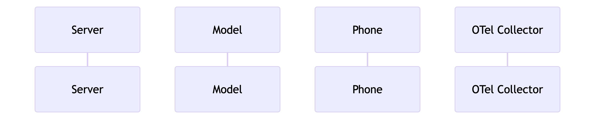{.r-stretch}

::: {.notes}
So the journey of a 👍 goes like this...
:::

## The Journey of a 👍 {.center data-transition="none"}

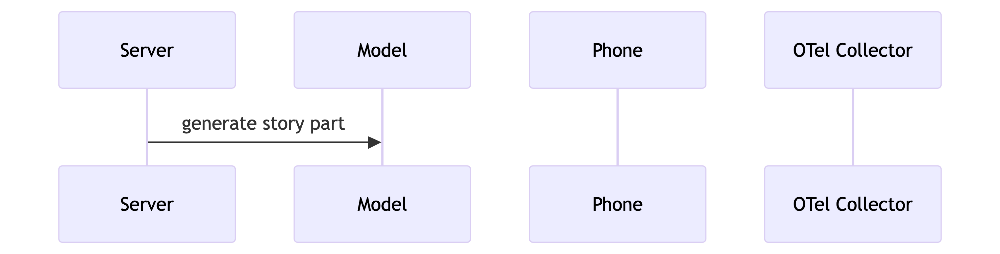{.r-stretch}

::: {.notes}
The server calls the model to generate a story part.
:::

## The Journey of a 👍 {.center data-transition="none"}

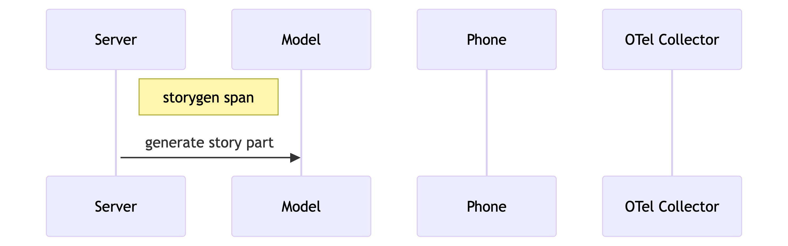{.r-stretch}

::: {.notes}
This starts the recording of the storygen span.
:::

## The Journey of a 👍 {.center data-transition="none"}

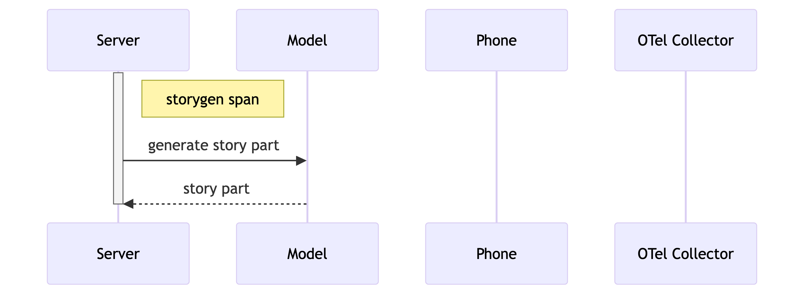{.r-stretch}

::: {.notes}
The model responds with the story part. The storygen span ends. The span now contains the model name, the prompt, and the response ID.
:::

## The Journey of a 👍 {.center data-transition="none"}

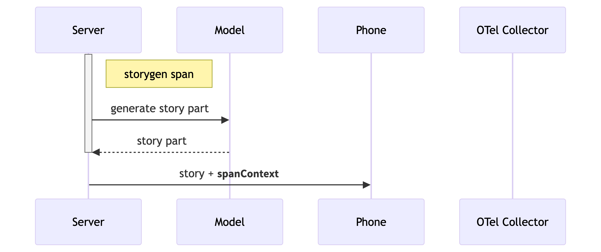{.r-stretch}

::: {.notes}
After it closes, the server sends the story part plus spanContext to you, the user. The spanContext is a type of token.
:::

## The Journey of a 👍 {.center data-transition="none"}

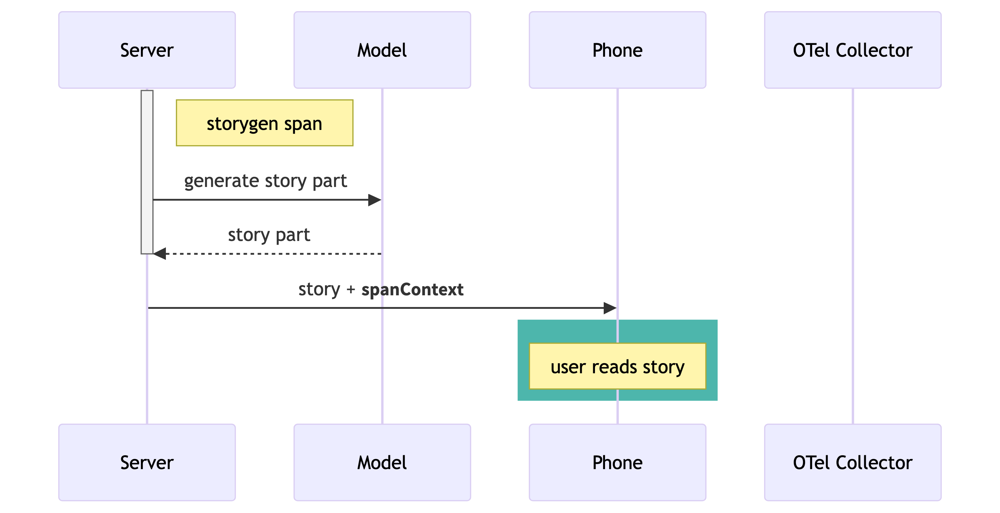{.r-stretch}

::: {.notes}
While you read the story, your device is holding onto the spanContext.
:::

## The Journey of a 👍 {.center data-transition="none"}

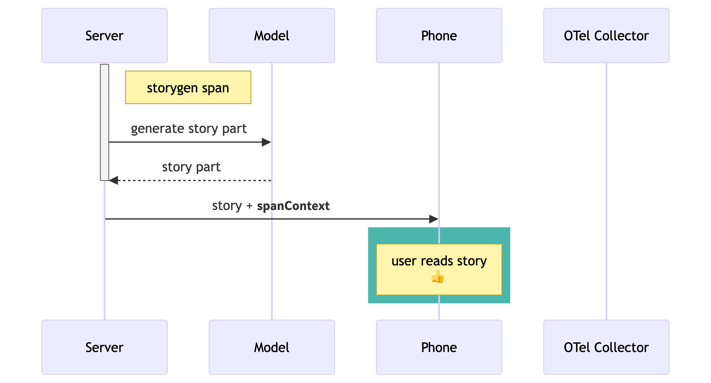{.r-stretch}

::: {.notes}
You vote! This is not captured by a span because it is client side.
:::

## The Journey of a 👍 {.center data-transition="none"}

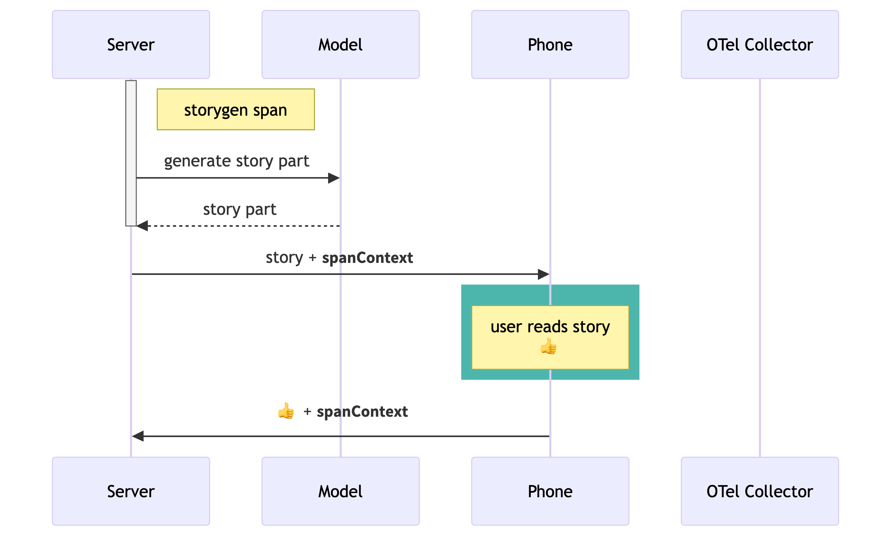{.r-stretch}

::: {.notes}
Your device sends your vote AND the spanContext back to the server.

The spanContext has round-tripped: server to phone and back.
:::

## The Journey of a 👍 {.center data-transition="none"}

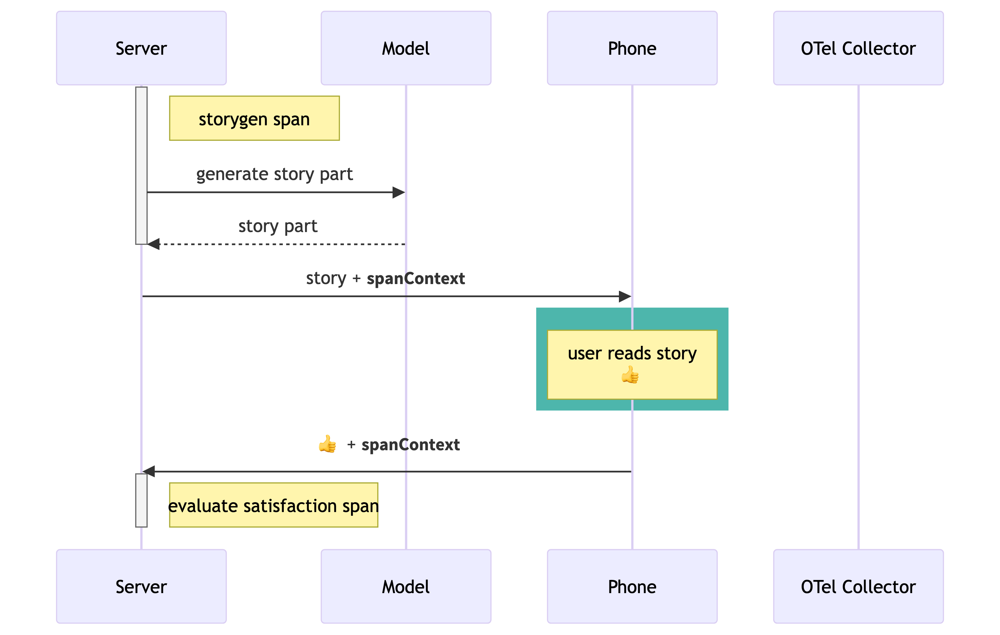{.r-stretch}

::: {.notes}
The server starts the evaluate satisfaction span, and uses the spanContext token to link it to the storygen span.
:::

## The Journey of a 👍 {.center data-transition="none"}

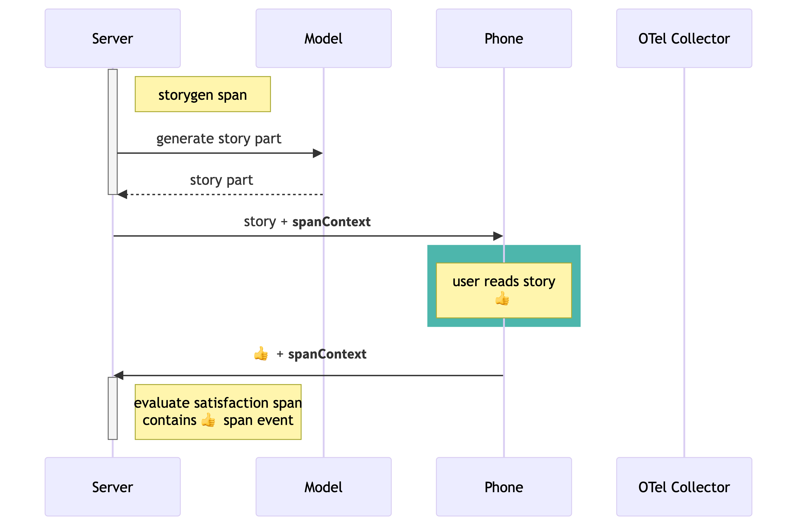{.r-stretch}

::: {.notes}
The span event with the vote data lives inside this 'evaluate satisfaction' span.
:::

## The Journey of a 👍 {.center data-transition="none"}

{.r-stretch}

::: {.notes}
Everything flows to the OTel Collector via OTLP.

Because of that spanContext token, the 'storygen' span is linked to 'evaluate satisfaction' span, so therefore your vote is correlated to information about what prompt and model were used for the story generation.
:::

## The Journey of a 👍 {.center data-transition="none"}

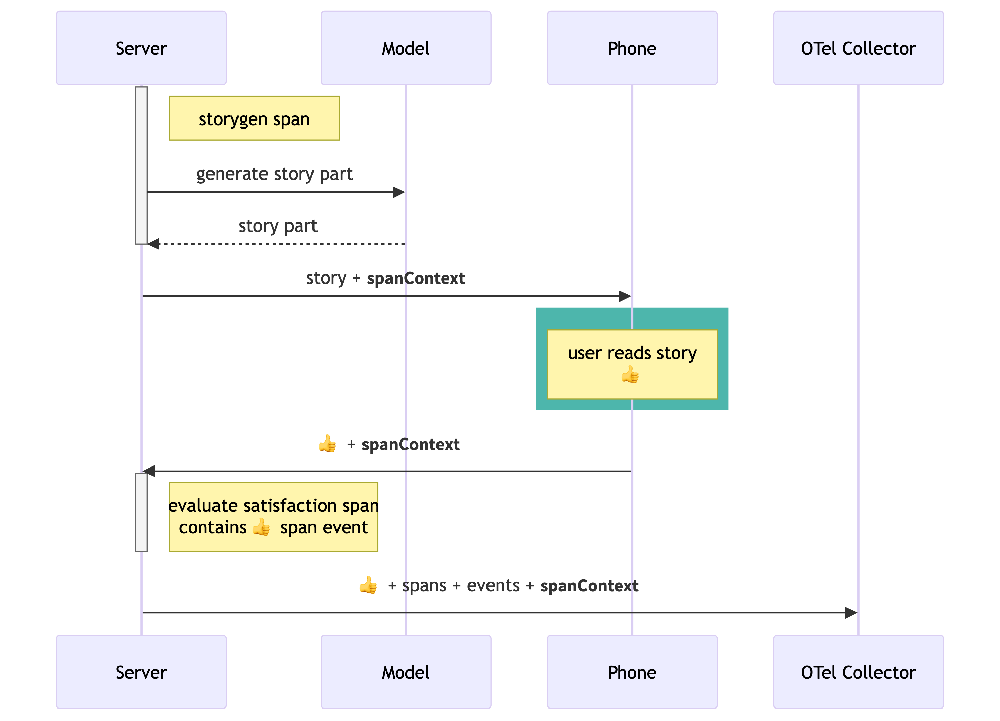{.r-stretch}

::: {.notes}
OpenTelemetry now has the complete picture: what was generated, by which prompt and which model, and how the user felt about it.
:::

## {.center data-transition="none"}

<p style="font-size: 1.3em;">...Now let's talk about how the right **metrics** come out of it</p>

::: {.notes}
...Now let's talk about how the right **metrics** come out of it

We need metrics because that is what Flagger uses to scale the application.
:::

## {.spaced .center}

To turn **trace data** into **metric data**, we need two things:

::: {.notes}
To turn **trace data** into **metric data**, we need two things:
:::

## {.spaced .center data-transition="none"}

To turn **trace data** into **metric data**, we need two things:

1. Make our nested span event **accessible at the span level**

::: {.notes}
1. Make our nested span event **accessible at the span level**

The vote data is trapped inside a span event. We need to surface it to the span level to make it more easily accessible later.
:::

## {.spaced .center data-transition="none"}

To turn **trace data** into **metric data**, we need two things:

1. Make our nested span event **accessible at the span level**

2. Turn span data into **Prometheus metrics**

::: {.notes}
Second goal: once the data is on the span, we need to convert those spans into metrics that Prometheus can scrape and Flagger can query.

We are going to accomplish these goals by using...
:::

## {.center}

<h2 style="font-size: 1.6em;">The OpenTelemetry Collector</h2>

::: {.notes}
The OpenTelemetry Collector is a pipeline that receives, processes, and exports telemetry
:::

## {.center data-transition="none"}

<h2 style="font-size: 1.6em; margin-bottom: 1em;">The OpenTelemetry Collector</h2>

<p style="font-size: 1.2em;">A pipeline that receives, processes, and exports telemetry</p>

::: {.notes}
It sits between the app and the observability backends (which for us is Prometheus and Datadog).

Telemetry data flows in to the collector, gets transformed, and flows out.
:::


## {.spaced .center}

What mechanism does the collector use to help us with our two goals?

::: {.notes}
So what mechanism does the collector use to help us with our two goals?
:::

## {.center}

<p style="font-size: 2.5em; font-weight: bold;">Processors</p>

::: {.notes}
Processors.
:::

## {.center data-transition="none"}

<p style="font-size: 1.2em;">**Processors** are pluggable components that transform telemetry as it flows through the collector</p>

::: {.notes}
**Processors** are pluggable components that transform telemetry as it flows through the collector.
:::

## {.spaced data-transition="none"}

Community-supported processors include:

::: {.notes}
Community-supported processors include:
:::

## {.spaced data-transition="none"}

Community-supported processors include:

- **Filter** out high-churn, noisy telemetry data

::: {.notes}
Processors that filter out high-churn, noisy telemetry data
:::

## {.spaced data-transition="none"}

Community-supported processors include:

- **Filter** out high-churn, noisy telemetry data

- **Batch** spans together for efficient export

::: {.notes}
Processors that **Batch** spans together for efficient export
:::

## {.spaced data-transition="none"}

Community-supported processors include:

- **Filter** out high-churn, noisy telemetry data

- **Batch** spans together for efficient export

- **Redact** sensitive fields before export

::: {.notes}
Processors that **Redact** sensitive fields before export
:::

## {.spaced data-transition="none"}

Community-supported processors include:

- **Filter** out high-churn, noisy telemetry data

- **Batch** spans together for efficient export

- **Redact** sensitive fields before export

- **Enrich** spans with Kubernetes pod and node metadata

::: {.notes}
Processors that **Enrich** spans with Kubernetes pod and node metadata

The collector ecosystem has many processors. These are just a few examples.

You can compose one or many processors into pipelines to shape your telemetry however you need.
:::

## The Collector Pipeline {data-transition="none"}

```{mermaid}
%%| fig-width: 10
graph LR
  apps["Server"] -->|"spans, events, spanContext"| collector
  subgraph collector ["OTel Collector"]
    empty[" "]
  end
  style empty fill:none,stroke:none
  style collector fill:none,stroke:#00897B,stroke-width:2px
```

::: {.notes}
For our rollout, we used two specific processors...
:::

## The Collector Pipeline {data-transition="none"}

```{mermaid}
%%| fig-width: 10
graph LR
  apps["Server"] -->|"spans, events, spanContext"| collector
  subgraph collector ["OTel Collector"]
    transform["Transform"]
  end
  style transform fill:#e8f5f3,stroke:#00897B
  style collector fill:none,stroke:#00897B,stroke-width:2px
```

**Transform Processor** — make span event data accessible at the span level

::: {.notes}
... the Transform processor that promotes span event attributes up to the parent span so downstream processors can read them...
:::


## The Collector Pipeline {data-transition="none"}

```{mermaid}
%%| fig-width: 10
graph LR
  apps["Server"] -->|"spans, events, spanContext"| collector
  subgraph collector ["OTel Collector"]
    transform["Transform"] --> spanmetrics["Spanmetrics"]
  end
  style transform fill:#e8f5f3,stroke:#00897B
  style spanmetrics fill:#e8f5f3,stroke:#00897B
  style collector fill:none,stroke:#00897B,stroke-width:2px
```

**Spanmetrics Processor** — turn spans into a counter metric Prometheus can understand

::: {.notes}
... And the spanmetrics connector which reads the promoted attributes on each span and produces a counter metric called gen_ai_calls_total.
:::


## The Collector Pipeline {data-transition="none"}

```{mermaid}
%%| fig-width: 10
graph LR
  apps["Server"] -->|"spans, events, spanContext"| collector
  subgraph collector ["OTel Collector"]
    transform["Transform"] --> spanmetrics["Spanmetrics"]
  end
  collector --> prometheus["Prometheus"]
  style transform fill:#e8f5f3,stroke:#00897B
  style spanmetrics fill:#e8f5f3,stroke:#00897B
  style collector fill:none,stroke:#00897B,stroke-width:2px
  style prometheus fill:#e0f2f1,stroke:#4DB6AC
```

We can now send metrics to **Prometheus**

::: {.notes}
We can now send metrics to **Prometheus**, where Flagger can use them
:::


## The Collector Pipeline {data-transition="none"}

```{mermaid}
%%| fig-width: 10
graph LR
  apps["Server"] -->|"spans, events, spanContext"| collector
  subgraph collector ["OTel Collector"]
    transform["Transform"] --> spanmetrics["Spanmetrics"]
  end
  collector --> prometheus["Prometheus"]
  collector --> datadog["Datadog"]
  style transform fill:#e8f5f3,stroke:#00897B
  style spanmetrics fill:#e8f5f3,stroke:#00897B
  style collector fill:none,stroke:#00897B,stroke-width:2px
  style prometheus fill:#e0f2f1,stroke:#4DB6AC
  style datadog fill:#e0f2f1,stroke:#4DB6AC
```

We also send data to **Datadog**

::: {.notes}
We also send telemetry data to Datadog. Datadog receives metrics AND traces via separate pipelines (datadog exporter + datadog/connector).

The connector generates additional metrics from traces, and the exporter ships data out to a Datadog endpoint. Together they give Datadog both raw traces and pre-computed metrics.
:::

# The Platform {.center data-transition="none"}

<span style="position: absolute; bottom: 20px; right: 40px; font-size: 4em; opacity: 0.8;">🌊</span>

## Cloud Native Platform  {.center data-transition="none"}

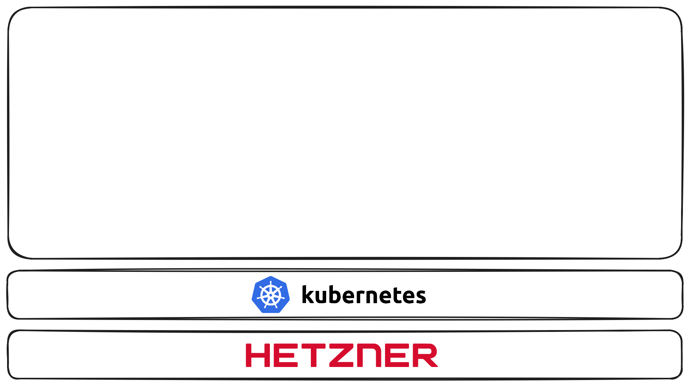{.r-stretch}

## Cloud Native Platform  {.center data-transition="none"}

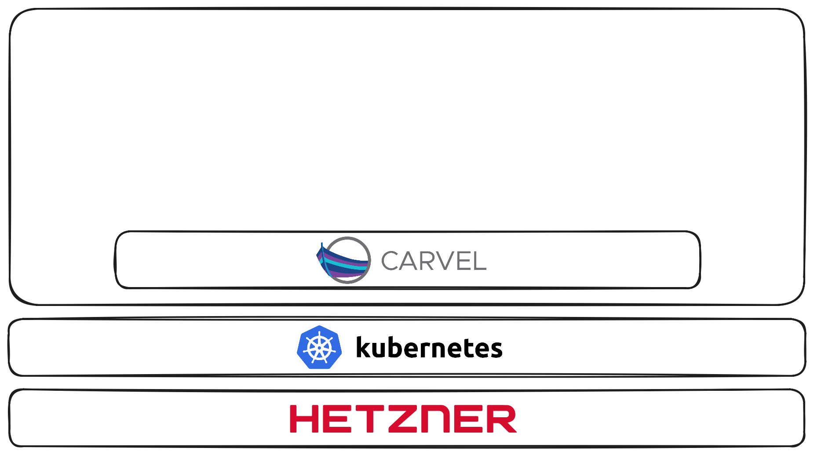{.r-stretch}

## Cloud Native Platform  {.center data-transition="none"}

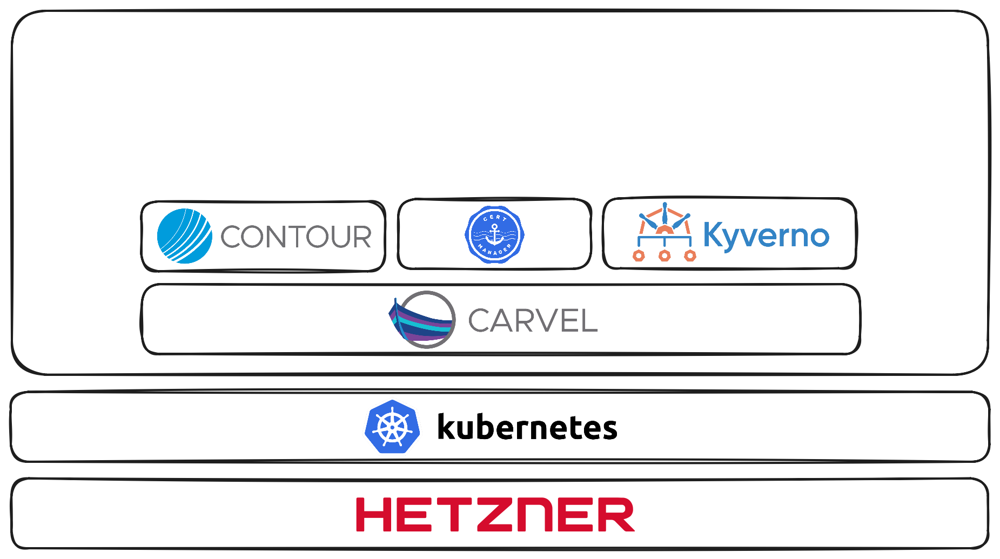{.r-stretch}

## Cloud Native Platform  {.center data-transition="none"}

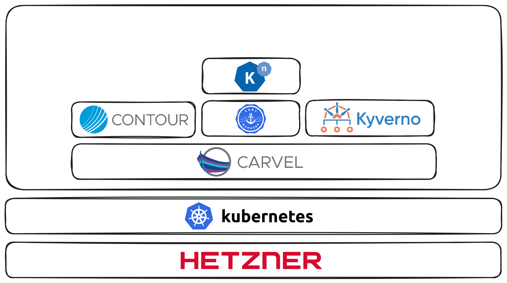{.r-stretch}

## Cloud Native Platform  {.center data-transition="none"}

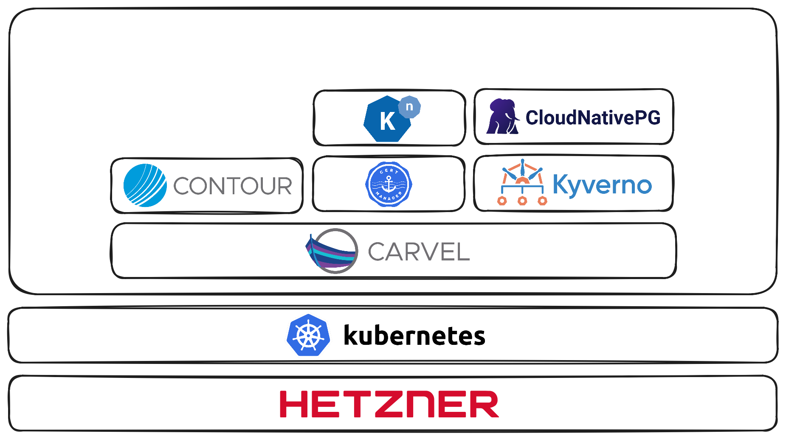{.r-stretch}

## Cloud Native Platform  {.center data-transition="none"}

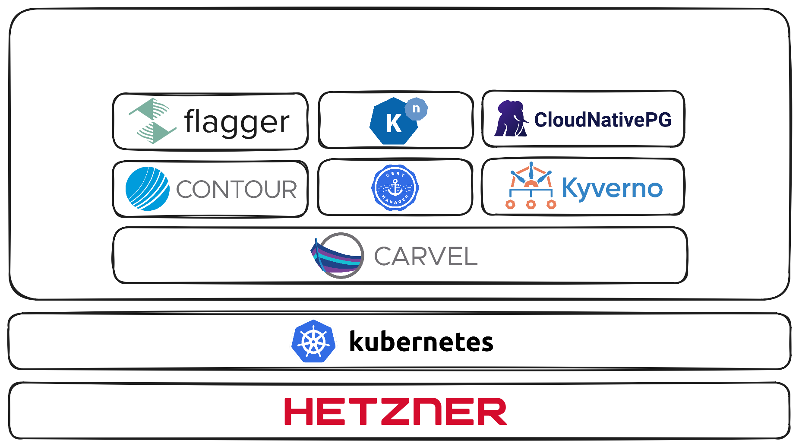{.r-stretch}

## Cloud Native Platform  {.center data-transition="none"}

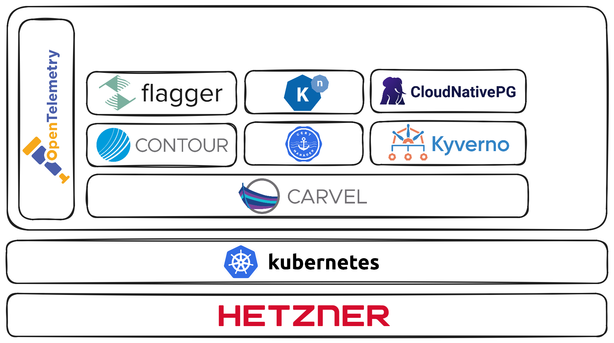{.r-stretch}

## Cloud Native Platform  {.center data-transition="none"}

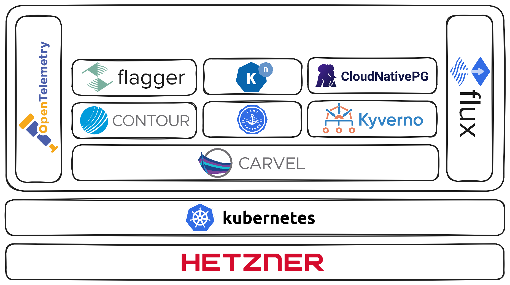{.r-stretch}

## Cloud Native Platform  {.center data-transition="none"}

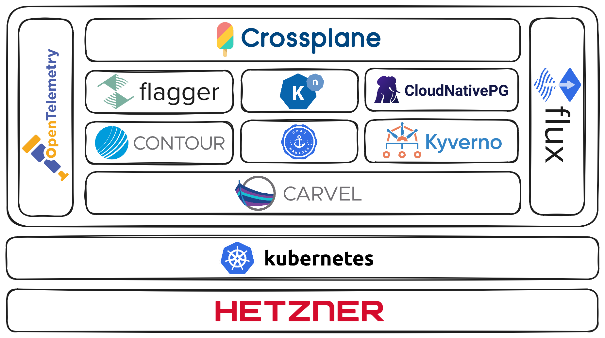{.r-stretch}

## Platform API {.center data-transition="none"}

{.r-stretch}

## Platform API {.center data-transition="none"}

{.r-stretch}

## Platform API  {.center data-transition="none"}

{.r-stretch}

## Platform API  {.center data-transition="none"}

{.r-stretch}

## Platform API  {.center data-transition="none"}

{.r-stretch}

## The Canary {.center data-transition="none"}

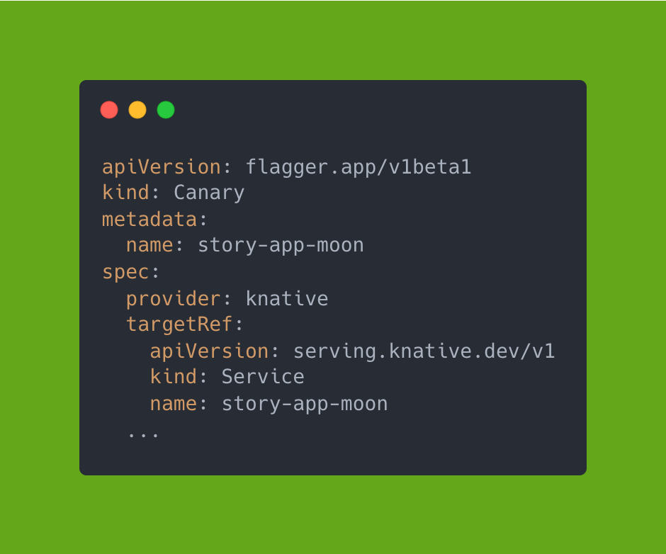{.r-stretch}

## The Canary {.center data-transition="none"}

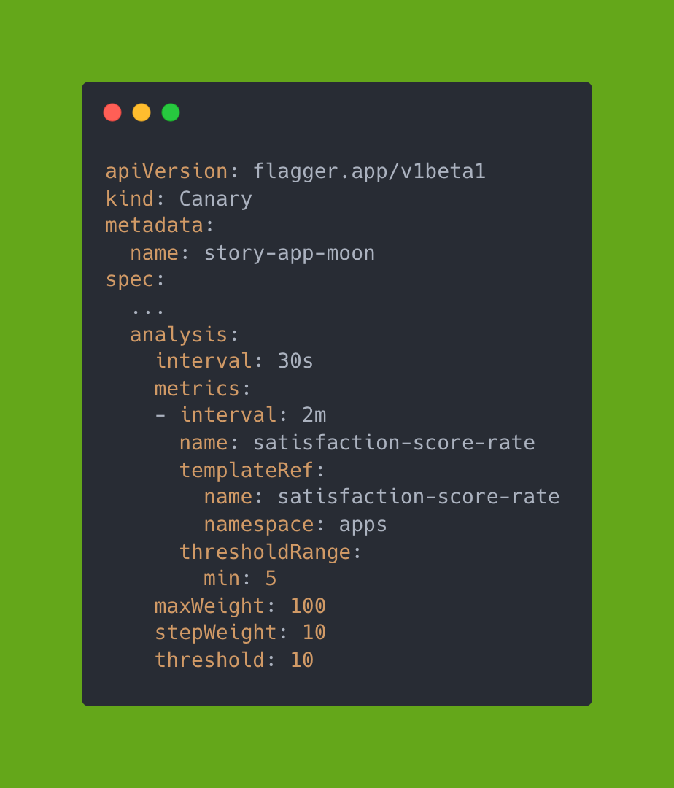{.r-stretch}

## The Canary {.center data-transition="none"}

{.r-stretch}

## The Canary {.center data-transition="none"}

{.r-stretch}

# GenAI-Infused Application {.center data-transition="none"}

<span style="position: absolute; bottom: 20px; right: 40px; font-size: 4em; opacity: 0.8;">🤖</span>

## Java Application {.center data-transition="none"}

{.r-stretch}

## Java Application {.center data-transition="none"}

{.r-stretch}

## Java Application {.center data-transition="none"}

{.r-stretch}

## Java Application {.center data-transition="none"}

{.r-stretch}

## Java Application {.center data-transition="none"}

{.r-stretch}

## Spring AI {.center data-transition="none"}

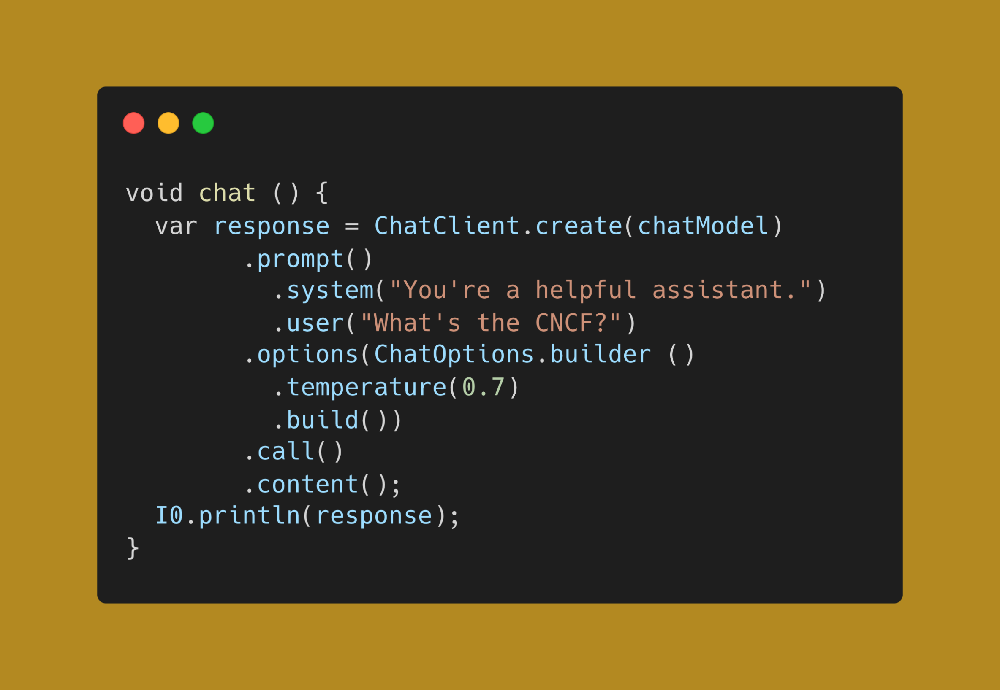{.r-stretch}

## Spring AI {.center data-transition="none"}

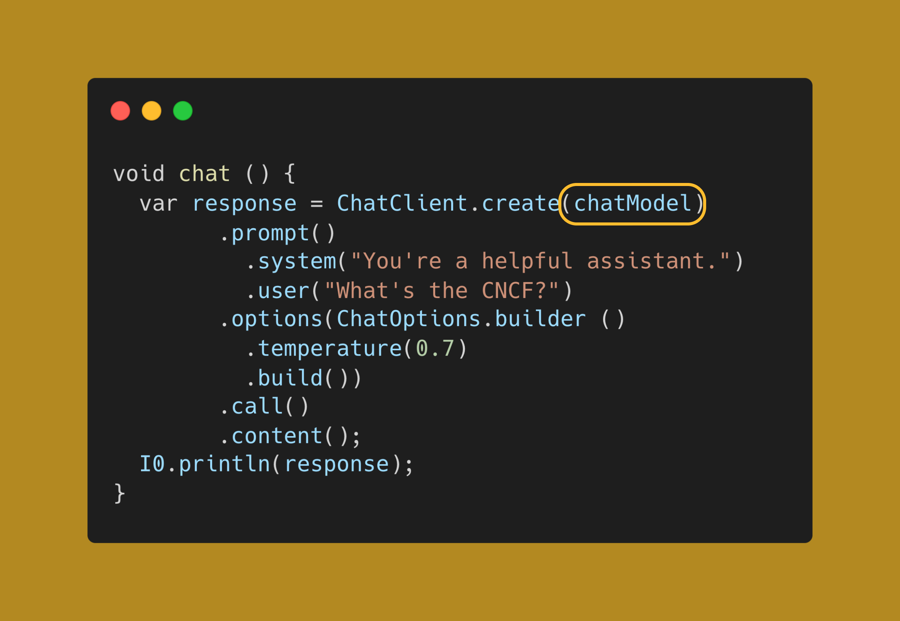{.r-stretch}

## Spring AI {.center data-transition="none"}

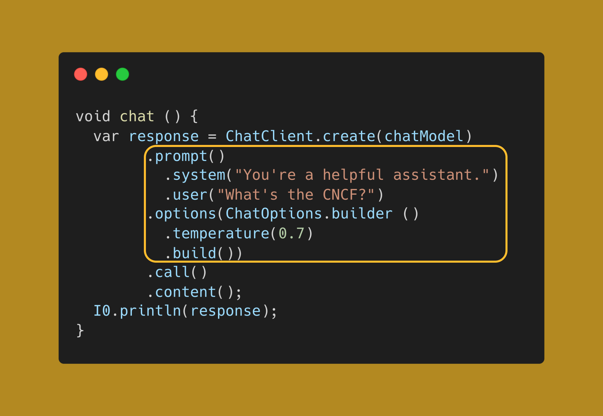{.r-stretch}

# Story Time {.center data-transition="none"}

<span style="position: absolute; bottom: 20px; right: 40px; font-size: 4em; opacity: 0.8;">📖</span>

## Time to Vote. Again! {.center}

{width=400}

Watch the votes come in: **[Datadog Dashboard](https://app.datadoghq.com/dashboard/68y-xeg-j6s)**

::: {.notes}
:::

## Did you figure out the **two versions** this time? {.center}

::: {.notes}
Did you put it together?
:::

## {.center data-transition="none"}

Same tone this time. Different **models**.

::: {.notes}
This time, both variants had the same tone. The difference was the model.
:::

## {.center data-transition="none"}

One was cheap. One was expensive.

::: {.notes}
Variant A used Mistral Large — a cheaper and faster model. Variant B used Opus 4.6 — a more expensive and slower model. Did the expensive one win?
:::

## {.center data-transition="none"}

<h2 style="font-size: 1.6em; margin-bottom: 1em;">Does expensive mean better?</h2>

<p style="font-size: 1.3em;">The platform doesn't care about price tags.</p>

<p style="font-size: 1.3em;">It cares about **thumbs up**.</p>

::: {.notes}
The teaching point: this is how a company decides whether spending more on a premium model is worthwhile. Do not assume the expensive option is better — instrument it, measure real user satisfaction, and let the data decide. The infrastructure doesn't care about price tags; it cares about thumbs up.
:::

# The Full Loop {.center data-transition="none"}

<span style="position: absolute; bottom: 20px; right: 40px; font-size: 4em; opacity: 0.8;">💡</span>

## What We Built Together {.center data-transition="none"}

{.r-stretch}

::: {.notes}
Wrap-up slide. Recap the key technologies and the audience's role. Emphasize: this isn't hypothetical — they just did it, live.
:::

## {background-image="images/whitney-lee.png" background-size="contain" background-color="white"}

::: {.notes}
Whitney Lee — Developer Advocate at Datadog. whitneylee.com
:::

## {background-image="images/thomas/thomas-vitale.png" background-size="contain" background-color="white"}

::: {.notes}
Thomas Vitale — software engineer at Systematic, author of Cloud Native Spring in Action (Manning). Arconia maintainer, Java Champion, CNCF Ambassador, Spring AI and Testcontainers contributor.
:::

## Thank You

Whitney Lee · Thomas Vitale

🦋 [@whitneylee.com](https://bsky.app/profile/whitneylee.com) &nbsp;&nbsp;&nbsp;&nbsp; 🦋 [@thomasvitale.com](https://bsky.app/profile/thomasvitale.com)

<br>

<p style="font-size: 1.0em; text-align: left; line-height: 1.4;">
**Platform Source Code**<br>
&nbsp;&nbsp;&nbsp;&nbsp;[github.com/ThomasVitale/kubecon-2026-gitops](https://github.com/ThomasVitale/kubecon-2026-gitops)<br>
**Application Source Code (Node.js)**<br>
&nbsp;&nbsp;&nbsp;&nbsp;[github.com/wiggitywhitney/scaling-on-satisfaction](https://github.com/wiggitywhitney/scaling-on-satisfaction)<br>
**Application Source Code (Java)**<br>
&nbsp;&nbsp;&nbsp;&nbsp;[github.com/ThomasVitale/scaling-on-satisfaction](https://github.com/ThomasVitale/scaling-on-satisfaction)
</p>
