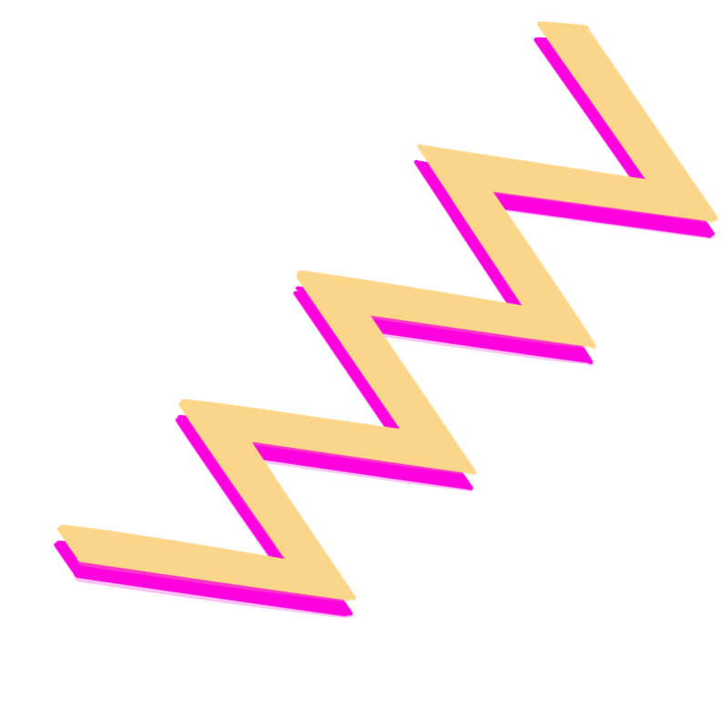
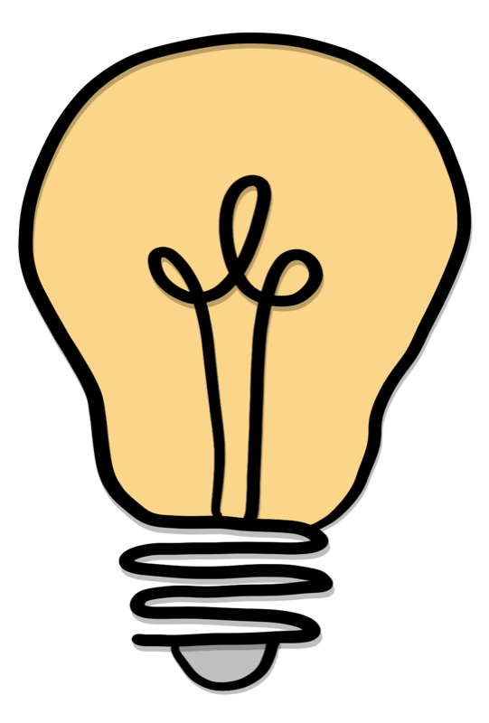
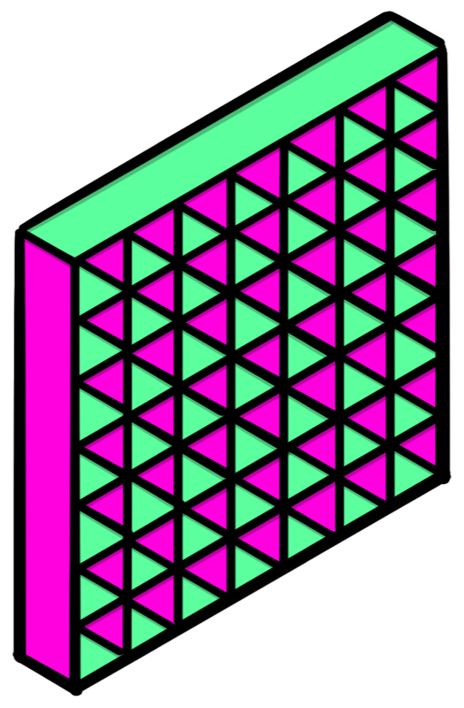
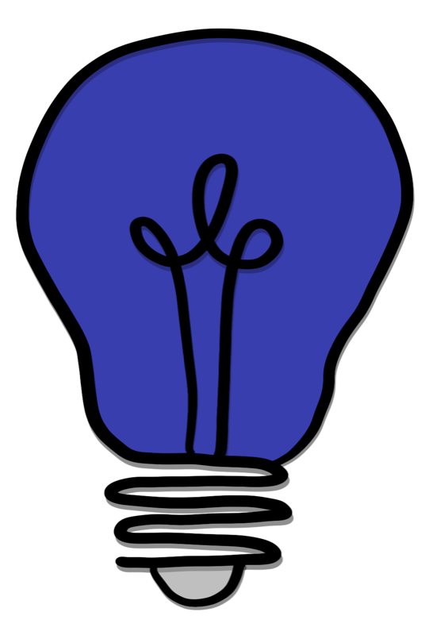
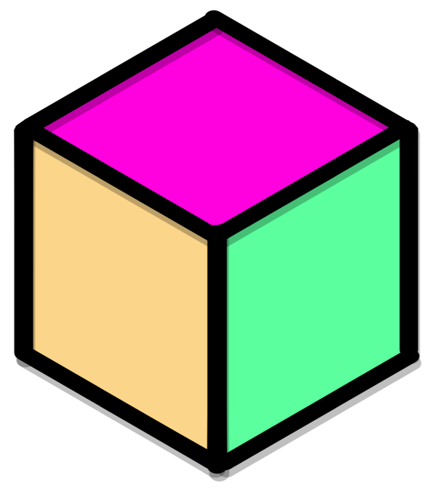
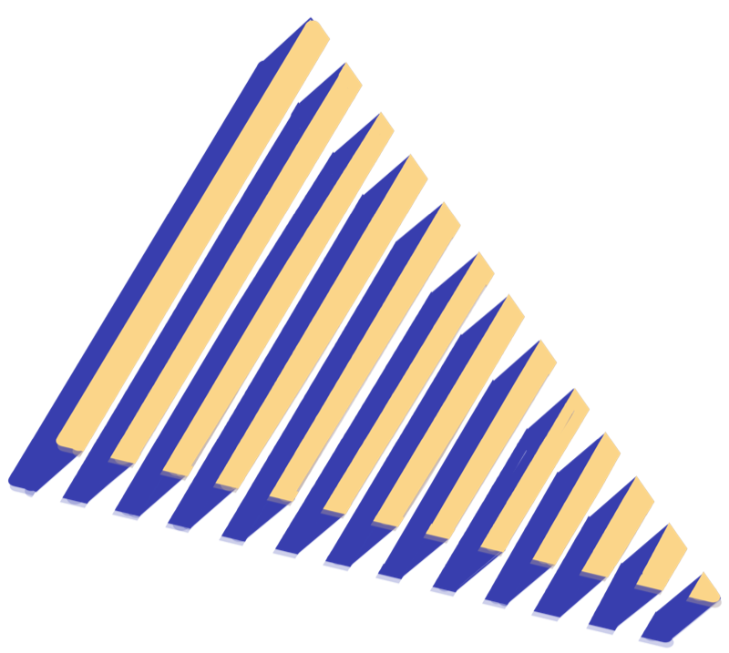

## {.center}

<h2 style="font-size: 1.8em; margin-bottom: 0.8em;">What We're Building</h2>

<p style="font-size: 1.3em;">A live feedback loop where<br/>**audience votes** drive infrastructure decisions.</p>

::: {.notes}
Welcome slide. Set context: in this talk, the audience will participate in two live demo rounds. Their votes on AI-generated stories will literally control the infrastructure — Flagger shifts traffic based on which variant gets more thumbs up. Between demos, we pull back the curtain and show how it all works.
:::

# The App {.center}

::: {.notes}
Section divider: Scene 1 — What the audience sees. Ground them in the user experience before any infrastructure talk.
:::

## What You'll See {.center}

::: {.notes}
Scene 1 opening — blank title slide. Pause here before revealing details one at a time.
:::

## What You'll See {.spaced data-transition="none"}

You'll open a URL on your phone

::: {.notes}
First reveal: just the basic action. The audience will open a URL.
:::

## What You'll See {.spaced data-transition="none"}

You'll open a URL on your phone

You'll read a short **AI-generated story** (5 parts)

::: {.notes}
Second reveal: the content. AI-generated story, 5 parts. The story is about 100 words per part, with named characters.
:::

## What You'll See {.spaced data-transition="none"}

You'll open a URL on your phone

You'll read a short **AI-generated story** (5 parts)

After each part, you vote: **thumbs up** or **thumbs down**

::: {.notes}
Third reveal: the interaction. Thumbs up or thumbs down on each part. Simple binary feedback.
:::

## What You Don't See {.spaced data-transition="none"}

**Two variants** of the app exist

::: {.notes}
New section — what the audience doesn't see. Two variants are running simultaneously. Everyone starts on variant A (the boring one). As votes come in, the platform decides whether to shift traffic to variant B.
:::

## What You Don't See {.spaced data-transition="none"}

**Two variants** of the app exist

Your votes **control what happens next**

::: {.notes}
The punchline. Their votes aren't just feedback — they're driving infrastructure decisions in real time. The platform will shift traffic based on which variant gets more thumbs up. Don't explain the mechanism yet. Let them sit with the mystery before moving to Scene 2.
:::

## Two Apps, One Stage {data-transition="none"}

```{mermaid}
%%| fig-width: 10
flowchart LR
  A["Variant A<br/>story-app-1a"] ~~~ B["Variant B<br/>story-app-1b"]
```

Two Knative Services running **different container images**

::: {.notes}
Scene 2, step 1: Start simple. Two Knative Services running side by side. Different images, different behavior. The key insight: variant differentiation via container images, not feature flags. Each has a pod label (app: story-app-1a vs story-app-1b) that becomes the OTel service.name via the Instrumentation CR.
:::

## Full Architecture {data-transition="none"}

```{mermaid}
%%| fig-width: 10
flowchart LR
  audience["Audience"] --> va["Variant A"]
  audience --> vb["Variant B"]
  va & vb -->|" "| collector[" "]
  collector -->|" "| platform[" "]
  platform -.->|" "| audience
  style collector fill:none,stroke:none
  style platform fill:none,stroke:none
  linkStyle 2 stroke:none
  linkStyle 3 stroke:none
  linkStyle 4 stroke:none
  linkStyle 5 stroke:none
```

Each story part, you might get **A or B** — it can switch mid-story

::: {.notes}
This isn't a static A/B test. You might get variant A for part 1 and variant B for part 3 — it depends on which variant is winning.
:::

## Full Architecture {data-transition="none"}

```{mermaid}
%%| fig-width: 10
flowchart LR
  audience["Audience"] --> va["Variant A"]
  audience --> vb["Variant B"]
  va & vb -->|"telemetry"| collector["OTel Collector"]
  collector -->|" "| platform[" "]
  platform -.->|" "| audience
  style platform fill:none,stroke:none
  linkStyle 4 stroke:none
  linkStyle 5 stroke:none
```

Both variants send telemetry to the same **OTel Collector**

::: {.notes}
Every vote, every story generation creates spans and span events. They all flow to the same collector, which is how we can compare the two variants.
:::

## Full Architecture {data-transition="none"}

```{mermaid}
%%| fig-width: 10
flowchart LR
  audience["Audience"] --> va["Variant A"]
  audience --> vb["Variant B"]
  va & vb -->|"telemetry"| collector["OTel Collector"]
  collector -->|"metrics"| platform["Platform"]
  platform -.->|" "| audience
  linkStyle 5 stroke:none
```

The collector turns telemetry into **comparable metrics**

::: {.notes}
Specifically, thumbs up percentage per variant. The platform (Flagger) watches these metrics.
:::

## Full Architecture {data-transition="none"}

```{mermaid}
%%| fig-width: 10
flowchart LR
  audience["Audience"] --> va["Variant A"]
  audience --> vb["Variant B"]
  va & vb -->|"telemetry"| collector["OTel Collector"]
  collector -->|"metrics"| platform["Platform"]
  platform -.->|"roll out winner"| audience
```

The platform uses those metrics to **roll out the more popular variant**

::: {.notes}
The platform shifts traffic toward whichever variant has higher satisfaction. This is the feedback loop — audience votes become telemetry, telemetry becomes metrics, metrics drive the rollout, and the audience gets more of the variant they prefer. We'll dig into each of these steps after Round 1.
:::

# Live Demo {.center}



::: {.notes}
Section divider: Round 1 Live Demo. Audience experiences the app for the first time.
:::

## Let's Try It

You're about to read a short AI-generated story.

After each part, vote: **thumbs up** or **thumbs down**.

That's it. Just read and react.



::: {.notes}
PRESENTER CUE: Keep this simple — don't reveal that there are two variants or what the difference is. The audience should just experience the app naturally. Switch to the Datadog dashboard on screen, THEN reveal the URL. The reveal of dry vs funny comes AFTER voting, in the debrief slide.
:::

## Time to Vote! {.center}

### Scan the QR code

Read each story part. Vote thumbs up or thumbs down.

::: {.notes}
PRESENTER CUE: Open the app in Chrome on your laptop, right-click, "Create QR code for this page", project it. Advance story parts from the admin panel as votes come in. Let 2-3 story parts play out (~3-4 minutes). When ready, click through to the dashboard slide.
:::

## [Live Dashboard](https://app.datadoghq.com/dashboard/68y-xeg-j6s?tv_mode=true) {.center}

Watch the votes come in:

**[Open Datadog Dashboard](https://app.datadoghq.com/dashboard/68y-xeg-j6s?tv_mode=true)**

::: {.notes}
PRESENTER CUE: Click the link to open the Datadog dashboard in TV mode. This shows votes per variant and satisfaction rates updating in real time. Stay on this while the audience votes. The dashboard URL is: https://app.datadoghq.com/dashboard/68y-xeg-j6s?tv_mode=true
:::

## The Reveal

There were **two versions** of that story.

| | Variant A | Variant B |
|---|---|---|
| **Tone** | Dry, matter-of-fact | Funny, playful |
| **Model** | Sonnet 4 | Sonnet 4 |

::: {.notes}
The big reveal. The audience didn't know there were two variants. Now show the Datadog dashboard — the funnier variant should have higher satisfaction. Point out that the system was already shifting traffic toward the winner while they were voting.
:::

## {.center data-transition="none"}

<h2 style="font-size: 1.6em; margin-bottom: 1em;">What Just Happened?</h2>

<p style="font-size: 1.3em; margin-bottom: 1.2em;">The platform **shifted traffic** toward the variant you liked more.</p>

<p style="font-size: 1.3em;">Now let's look at exactly how.</p>

::: {.notes}
Transition to teaching scenes. The audience saw the feedback loop diagram in Scene 2, but now we'll dig into each component: how votes become telemetry, how the collector turns telemetry into metrics, and how Flagger uses those metrics to shift traffic.
:::

# How It Works {.center}



::: {.notes}
Section divider: Teaching scenes. Now we explain the infrastructure behind what they just experienced.
:::

## How a Vote Becomes Data {.center}

::: {.notes}
Scene 3 title slide. This is where we introduce OpenTelemetry for the first time.
:::

## You Tap Thumbs Up {data-transition="none"}

```{mermaid}
%%| fig-width: 10
graph TD
  user["You"] -->|"👍"| server["Server"]
```

::: {.notes}
Start simple. The user taps thumbs up. What happens inside the server?
:::

## The Server Creates a Span {data-transition="none"}

```{mermaid}
%%| fig-width: 10
graph TD
  user["You"] -->|"👍"| server["Server"]
  server --> span
  subgraph otel ["OpenTelemetry"]
    span["evaluate UserSatisfaction<br/>(span)"]
  end
  style span fill:#e8f5f3,stroke:#00897B
  style otel fill:none,stroke:#00897B,stroke-width:2px
```

The server creates an **OpenTelemetry span** — a unit of work

::: {.notes}
First mention of OpenTelemetry. A span is a structured unit of work — connected to other spans in a trace. The server creates one called "evaluate UserSatisfaction" every time someone votes.
:::

## The Vote Creates a Span Event {data-transition="none"}

```{mermaid}
%%| fig-width: 10
graph TD
  user["You"] -->|"👍"| server["Server"]
  server --> span
  subgraph otel ["OpenTelemetry"]
    span["evaluate UserSatisfaction<br/>(span)"] -->|"timestamp"| event["gen_ai.evaluation.result<br/>(span event)"]
  end
  style span fill:#e8f5f3,stroke:#00897B
  style event fill:#e0f2f1,stroke:#4DB6AC
  style otel fill:none,stroke:#00897B,stroke-width:2px
```

The vote is recorded as a **span event** inside the span

::: {.notes}
The span event appears as a child of the span. It's called gen_ai.evaluation.result and it carries the vote data. The audience sees the visual relationship before we explain what a span event is.
:::

## {.center data-transition="none"}

<h2 style="font-size: 1.8em;">What's a span event?</h2>

::: {.notes}
Pause here. Let the question land. Most people think OTel = spans and metrics. Span events are the underused third concept.
:::

## {.center data-transition="none"}

<h2 style="font-size: 1.8em; margin-bottom: 1.2em;">What's a span event?</h2>

<p style="font-size: 1.3em; margin-bottom: 1em;">OTel's **structured log**</p>

<p style="font-size: 1.3em;">Automatically correlated with the trace</p>

::: {.notes}
A span event is a thing that happened during a span — like a log entry, but it lives inside the span, so you get trace context for free. No manual correlation needed.
:::

## Semantic Conventions {.center data-transition="none"}

<p style="font-size: 1.3em; margin-bottom: 1em;">**gen_ai semantic conventions**</p>

<p style="font-size: 1.1em;">A standard vocabulary — not custom fields</p>

<p style="font-size: 1.1em;">Any OTel-compatible tool knows what these mean</p>

::: {.notes}
This is the "why should I care" beat. The attributes on the span event aren't made up — they follow gen_ai semantic conventions. score.label = thumbs_up, score.value = 1.0, story.part = 3. Because these are standardized, any OTel tool (Datadog, Jaeger, Grafana) can read and act on them without custom configuration.
:::

## The Journey of a 👍 {data-transition="fade"}

```{mermaid}
%%| fig-width: 10
sequenceDiagram
  participant S as Server
  participant M as Model
  participant P as Phone
  participant C as OTel Collector
```

::: {.notes}
Empty diagram — just the four participants. Fade transition from the previous flowchart for visual continuity.
:::

## The Journey of a 👍 {data-transition="none"}

```{mermaid}
%%| fig-width: 10
sequenceDiagram
  participant S as Server
  participant M as Model
  participant P as Phone
  participant C as OTel Collector

  S->>M: generate story part
```

::: {.notes}
The server calls the model to generate a story part.
:::

## The Journey of a 👍 {data-transition="none"}

```{mermaid}
%%| fig-width: 10
sequenceDiagram
  participant S as Server
  participant M as Model
  participant P as Phone
  participant C as OTel Collector

  activate S
  Note right of S: storygen span
  S->>M: generate story part
```

::: {.notes}
This is wrapped in a storygen span — the activate bar shows the span is open while we wait for the model.
:::

## The Journey of a 👍 {data-transition="none"}

```{mermaid}
%%| fig-width: 10
sequenceDiagram
  participant S as Server
  participant M as Model
  participant P as Phone
  participant C as OTel Collector

  activate S
  Note right of S: storygen span
  S->>M: generate story part
  M-->>S: story part
  deactivate S
```

::: {.notes}
The model responds with the story part. The storygen span closes — it now contains the model name and response ID.
:::

## The Journey of a 👍 {data-transition="none"}

```{mermaid}
%%| fig-width: 10
sequenceDiagram
  participant S as Server
  participant M as Model
  participant P as Phone
  participant C as OTel Collector

  activate S
  Note right of S: storygen span
  S->>M: generate story part
  M-->>S: story part
  deactivate S
  S->>P: story + 𝘀𝗽𝗮𝗻𝗖𝗼𝗻𝘁𝗲𝘅𝘁
```

::: {.notes}
The storygen span wraps the model call. After it closes, the server sends the story plus the spanContext to the phone. The spanContext is the token that will link everything together later.
:::

## The Journey of a 👍 {data-transition="none"}

```{mermaid}
%%| fig-width: 10
sequenceDiagram
  participant S as Server
  participant M as Model
  participant P as Phone
  participant C as OTel Collector

  activate S
  Note right of S: storygen span
  S->>M: generate story part
  M-->>S: story part
  deactivate S
  S->>P: story + 𝘀𝗽𝗮𝗻𝗖𝗼𝗻𝘁𝗲𝘅𝘁
  rect rgb(77, 182, 172)
  Note over P: user reads story
  end
```

::: {.notes}
The user reads the story. The phone is holding onto the spanContext this whole time.
:::

## The Journey of a 👍 {data-transition="none"}

```{mermaid}
%%| fig-width: 10
sequenceDiagram
  participant S as Server
  participant M as Model
  participant P as Phone
  participant C as OTel Collector

  activate S
  Note right of S: storygen span
  S->>M: generate story part
  M-->>S: story part
  deactivate S
  S->>P: story + 𝘀𝗽𝗮𝗻𝗖𝗼𝗻𝘁𝗲𝘅𝘁
  rect rgb(77, 182, 172)
  Note over P: user reads story<br/>👍
  end
```

::: {.notes}
The user taps thumbs up.
:::

## The Journey of a 👍 {data-transition="none"}

```{mermaid}
%%| fig-width: 10
sequenceDiagram
  participant S as Server
  participant M as Model
  participant P as Phone
  participant C as OTel Collector

  activate S
  Note right of S: storygen span
  S->>M: generate story part
  M-->>S: story part
  deactivate S
  S->>P: story + 𝘀𝗽𝗮𝗻𝗖𝗼𝗻𝘁𝗲𝘅𝘁
  rect rgb(77, 182, 172)
  Note over P: user reads story<br/>👍
  end
  P->>S: 👍 + 𝘀𝗽𝗮𝗻𝗖𝗼𝗻𝘁𝗲𝘅𝘁
```

::: {.notes}
The phone sends the vote AND the spanContext back to the server. The spanContext has round-tripped: server to phone and back.
:::

## The Journey of a 👍 {data-transition="none"}

```{mermaid}
%%| fig-width: 10
sequenceDiagram
  participant S as Server
  participant M as Model
  participant P as Phone
  participant C as OTel Collector

  activate S
  Note right of S: storygen span
  S->>M: generate story part
  M-->>S: story part
  deactivate S
  S->>P: story + 𝘀𝗽𝗮𝗻𝗖𝗼𝗻𝘁𝗲𝘅𝘁
  rect rgb(77, 182, 172)
  Note over P: user reads story<br/>👍
  end
  P->>S: 👍 + 𝘀𝗽𝗮𝗻𝗖𝗼𝗻𝘁𝗲𝘅𝘁
  activate S
  Note right of S: evaluate satisfaction span
  deactivate S
```

::: {.notes}
The server creates the evaluate satisfaction span, links it to the storygen span using the spanContext.
:::

## The Journey of a 👍 {data-transition="none"}

```{mermaid}
%%| fig-width: 10
sequenceDiagram
  participant S as Server
  participant M as Model
  participant P as Phone
  participant C as OTel Collector

  activate S
  Note right of S: storygen span
  S->>M: generate story part
  M-->>S: story part
  deactivate S
  S->>P: story + 𝘀𝗽𝗮𝗻𝗖𝗼𝗻𝘁𝗲𝘅𝘁
  rect rgb(77, 182, 172)
  Note over P: user reads story<br/>👍
  end
  P->>S: 👍 + 𝘀𝗽𝗮𝗻𝗖𝗼𝗻𝘁𝗲𝘅𝘁
  activate S
  Note right of S: evaluate satisfaction span<br/>contains 👍 span event
  deactivate S
```

::: {.notes}
The span event with the vote data lives inside the evaluate satisfaction span.
:::

## The Journey of a 👍 {data-transition="none"}

```{mermaid}
%%| fig-width: 10
sequenceDiagram
  participant S as Server
  participant M as Model
  participant P as Phone
  participant C as OTel Collector

  activate S
  Note right of S: storygen span
  S->>M: generate story part
  M-->>S: story part
  deactivate S
  S->>P: story + 𝘀𝗽𝗮𝗻𝗖𝗼𝗻𝘁𝗲𝘅𝘁
  rect rgb(77, 182, 172)
  Note over P: user reads story<br/>👍
  end
  P->>S: 👍 + 𝘀𝗽𝗮𝗻𝗖𝗼𝗻𝘁𝗲𝘅𝘁
  activate S
  Note right of S: evaluate satisfaction span<br/>contains 👍 span event
  deactivate S
  S->>C: 👍 + spans + events + 𝘀𝗽𝗮𝗻𝗖𝗼𝗻𝘁𝗲𝘅𝘁
```

**spanContext** links **storygen** span to **evaluate satisfaction** span

::: {.notes}
Everything flows to the OTel Collector via OTLP. The spanContext is what links the storygen span to the evaluate satisfaction span.
:::

## The Journey of a 👍 {data-transition="none"}

```{mermaid}
%%| fig-width: 10
sequenceDiagram
  participant S as Server
  participant M as Model
  participant P as Phone
  participant C as OTel Collector

  activate S
  Note right of S: storygen span
  S->>M: generate story part
  M-->>S: story part
  deactivate S
  S->>P: story + 𝘀𝗽𝗮𝗻𝗖𝗼𝗻𝘁𝗲𝘅𝘁
  rect rgb(77, 182, 172)
  Note over P: user reads story<br/>👍
  end
  P->>S: 👍 + 𝘀𝗽𝗮𝗻𝗖𝗼𝗻𝘁𝗲𝘅𝘁
  activate S
  Note right of S: evaluate satisfaction span<br/>contains 👍 span event
  deactivate S
  S->>C: 👍 + spans + events + 𝘀𝗽𝗮𝗻𝗖𝗼𝗻𝘁𝗲𝘅𝘁
```

OpenTelemetry receives a **holistic picture of one user's experience**

::: {.notes}
The punchline. OpenTelemetry now has the complete picture: what was generated, by which model, for which variant, and how the user felt about it. This bridges into Scene 4 — what the collector does with this data.
:::

## Here's What It Looks Like {.center data-transition="none"}

**[See a real trace in Datadog](https://app.datadoghq.com/apm/traces?query=operation_name%3Aevaluate%20UserSatisfaction)**

::: {.notes}
PRESENTER CUE: Click this link to open Datadog APM traces filtered to evaluate satisfaction spans. Pick any trace, expand it, show the span event with its attributes. Quick aside — 30 seconds max — then back to slides. This only works if Thomas's cluster is running and has recent traffic.
:::

## {.center}

<h2 style="font-size: 1.6em;">But how does an app scale on traces?</h2>

::: {.notes}
Let the question land. The audience has seen how votes become telemetry. But Flagger doesn't read traces — it reads metrics. How do we get from one to the other?
:::

## {.center data-transition="none"}

<h2 style="font-size: 1.6em; margin-bottom: 1em;">But how does an app scale on traces?</h2>

<p style="font-size: 1.3em;">I thought Flagger uses Prometheus.</p>

::: {.notes}
The audience should be wondering this. Flagger uses PromQL queries against Prometheus metrics. But everything we've shown so far is traces and span events. This tension is exactly what Scene 4 resolves.
:::

## {.spaced .center}

To turn trace data into metric data, we need two things:

1. Make our nested span event **accessible at the span level**

2. Turn span data into **Prometheus metrics**

::: {.notes}
Set the context. The audience knows how votes become telemetry (Scene 3). Now they need to understand the two transformations required before Flagger can use this data.
:::

## {.center data-transition="none"}

<h2 style="font-size: 1.6em;">The OTel Collector</h2>

<p style="font-size: 1.2em;">A pipeline that receives, processes, and exports telemetry</p>

::: {.notes}
Introduce the collector. It sits between the apps and the backends. It has a large ecosystem of community-supported processors.
:::

## {.center data-transition="none"}

<p style="font-size: 1.2em;">**Processors** are pluggable components that transform telemetry as it flows through the collector</p>

<p style="font-size: 0.9em; margin-top: 0.8em;">filter, batch, transform, tail sampling, redaction, k8s attributes, ...</p>

::: {.notes}
The collector has a large ecosystem of community-supported processors. Examples: filter (drop unwanted data), batch (group for efficiency), transform (modify attributes), tail sampling (sample based on trace outcome), redaction (strip sensitive data), k8s attributes (enrich with pod/node info). You compose them into pipelines.
:::

## {.spaced .center data-transition="none"}

We will use two **processors**:

1. **Transform Processor** — make span event data accessible at the span level

2. **Spanmetrics Processor** — turn spans into a counter metric Prometheus can understand

::: {.notes}
Preview the two steps before diving into each one. The audience knows what's coming.
:::

## The Collector Pipeline {data-transition="none"}

```{mermaid}
%%| fig-width: 10
graph LR
  apps["Apps"] -->|"OTLP"| transform
  subgraph collector ["OTel Collector"]
    transform["Transform"]
  end
  style transform fill:#e8f5f3,stroke:#00897B
  style collector fill:none,stroke:#00897B,stroke-width:2px
```

**Step 1**: Make span event data accessible at the span level

::: {.notes}
The vote data lives on a span event, nested inside the span. But the next processor (spanmetrics) only reads span-level attributes. So we need to "promote" the data up first. This is the transform processor's job.
:::

## The Collector Pipeline {data-transition="none"}

```{.yaml code-line-numbers="|3-4|5-8"}
processors:
  transform:
    trace_statements:
      - context: spanevent
        statements:
          - set(span.attributes["score.label"],
                attributes["score.label"])
            where name == "gen_ai.evaluation.result"
```

The **transform** processor promotes event attributes up to the span

::: {.notes}
Show the actual YAML from the collector config. The spanevent context lets us read event attributes and write them to span.attributes. Walk through it: context is spanevent, we read the attribute, write it to the parent span, but only for our specific event name. Without this, spanmetrics would have no idea what the votes were.
:::

## {.center data-transition="none"}

<p style="font-size: 1.3em; margin-bottom: 1em;">Now the vote data is on the span itself</p>

<p style="font-size: 1.3em;">**Step 2**: Turn spans into metrics</p>

::: {.notes}
Transition between the two steps. The transform processor solved step 1. Now spanmetrics takes over for step 2.
:::

## The Collector Pipeline {data-transition="none"}

```{mermaid}
%%| fig-width: 10
graph LR
  apps["Apps"] -->|"OTLP"| transform
  subgraph collector ["OTel Collector"]
    transform["Transform"] --> spanmetrics["Spanmetrics"]
  end
  style transform fill:#e8f5f3,stroke:#00897B
  style spanmetrics fill:#e8f5f3,stroke:#00897B
  style collector fill:none,stroke:#00897B,stroke-width:2px
```

The **spanmetrics** connector turns spans into a counter metric

::: {.notes}
The spanmetrics connector reads the promoted attributes on each span and produces a counter metric called gen_ai_calls_total. Dimensions include service_name (which variant), score.label (thumbs_up or thumbs_down), and story.part (1-5). This is the bridge from traces to metrics.
:::

## The Collector Pipeline {data-transition="none"}

```{mermaid}
%%| fig-width: 10
graph LR
  apps["Apps"] -->|"OTLP"| transform
  subgraph collector ["OTel Collector"]
    transform["Transform"] --> spanmetrics["Spanmetrics"]
  end
  spanmetrics --> prometheus["Prometheus"]
  spanmetrics --> datadog["Datadog"]
  style transform fill:#e8f5f3,stroke:#00897B
  style spanmetrics fill:#e8f5f3,stroke:#00897B
  style collector fill:none,stroke:#00897B,stroke-width:2px
  style prometheus fill:#e0f2f1,stroke:#4DB6AC
  style datadog fill:#e0f2f1,stroke:#4DB6AC
```

::: {.notes}
Two outputs fork from the same metrics. Prometheus is in-cluster — Flagger queries it for canary decisions. Datadog is external — the dashboard you saw during the demo. Same data, two purposes. This decouples the in-cluster rollout decision from the visualization layer.
:::

## The Collector Pipeline {data-transition="none"}

```{mermaid}
%%| fig-width: 10
graph LR
  apps["Apps"] -->|"OTLP"| transform
  subgraph collector ["OTel Collector"]
    transform["Transform"] --> spanmetrics["Spanmetrics"]
  end
  spanmetrics --> prometheus["Prometheus<br/>(Flagger queries this)"]
  spanmetrics --> datadog["Datadog<br/>(you saw this)"]
  style transform fill:#e8f5f3,stroke:#00897B
  style spanmetrics fill:#e8f5f3,stroke:#00897B
  style collector fill:none,stroke:#00897B,stroke-width:2px
  style prometheus fill:#e0f2f1,stroke:#4DB6AC
  style datadog fill:#e0f2f1,stroke:#4DB6AC
```

**Prometheus** for rollout decisions — **Datadog** for dashboards

::: {.notes}
Drive this home: Prometheus is what Flagger reads. Datadog is what you watched during the demo. Same underlying metric, two different consumers. The collector is the single place where traces become metrics and fan out to both.
:::

## Flagger's Canary Logic

<!-- TODO (M6): Incremental Flagger decision loop diagram -->
<!-- Build 1: Prometheus scrapes gen_ai_calls_total every 3s -->
<!-- Build 2: Flagger runs PromQL: (B thumbs_up %) - (A thumbs_up %) -->
<!-- Build 3: Delta >= 5pp for 3 consecutive checks → advance traffic weight by 10% -->
<!-- Build 4: Traffic split progression: 90/10 → 80/20 → ... → 0/100 -->
<!-- Build 5: Delta drops below threshold → rollback to 100% A -->

::: {.notes}
Scene 5: The Decision — Flagger's Canary Logic.
Show how metrics drive automated rollout decisions. Key teaching point: threshold is relative (B must be 5 percentage points better than A), not absolute. The system promotes the variant that makes users happier.
Incremental build: (1) Prometheus scrapes collector, (2) Flagger runs PromQL query, (3) threshold check, (4) traffic split progression, (5) rollback if delta drops.
:::

# Live Demo {.center}

::: {.notes}
Section divider: Round 2 Live Demo. Now the audience understands the infrastructure — their votes have new meaning.
:::

## This Time You Know

Now you understand the feedback loop.

This time: **two different models**, same tone.

One is cheap. One is expensive. Which one do you prefer?

::: {.notes}
PRESENTER CUE: The audience now understands the infrastructure from the teaching scenes. Frame this round differently — they know their votes control the rollout. The tension is real: does the expensive model actually produce better stories? Variants: 2a (Haiku 4.5, cheap) vs 2b (Opus 4.6, expensive), same tone. The outcome is genuinely unknown.
:::

## Time to Vote — Again! {.center}

### Scan the QR code

::: {.notes}
PRESENTER CUE: Same URL as before. Advance story parts from the admin panel. Let 2-3 story parts play out (~3-4 minutes). This time, also narrate what's happening: "The platform is watching your votes right now. If one model pulls ahead, traffic will shift."
:::

## [Live Dashboard](https://app.datadoghq.com/dashboard/68y-xeg-j6s?tv_mode=true) {.center}

Watch the votes — and the **canary progression**:

**[Open Datadog Dashboard](https://app.datadoghq.com/dashboard/68y-xeg-j6s?tv_mode=true)**

::: {.notes}
PRESENTER CUE: Click the link to open the Datadog dashboard in TV mode. This time, also point out the Flagger canary progression if visible — traffic weight shifting in real time. The audience can see their votes driving the rollout.
:::

## The Reveal

| | Variant A | Variant B |
|---|---|---|
| **Tone** | Same | Same |
| **Model** | Haiku 4.5 (cheap) | Opus 4.6 (expensive) |

::: {.notes}
Reveal the model difference. Show the Datadog dashboard results. The expensive model might not have won — that's the point.
:::

## {.center data-transition="none"}

<h2 style="font-size: 1.6em; margin-bottom: 1em;">Does expensive mean better?</h2>

<p style="font-size: 1.3em;">The platform doesn't care about price tags.</p>

<p style="font-size: 1.3em;">It cares about **thumbs up**.</p>

::: {.notes}
The teaching point: this is how a company decides whether spending more on a premium model is worthwhile. Do not assume the expensive option is better — instrument it, measure real user satisfaction, and let the data decide. The infrastructure doesn't care about price tags; it cares about thumbs up.
:::

# The Full Loop {.center}



::: {.notes}
Section divider: Scene 6 — Closing the feedback loop. Tie everything together.
:::

## Closing the Feedback Loop

<!-- TODO (M6): Full architecture diagram with the feedback loop highlighted -->
<!-- Complete pipeline: Audience votes → App span events → Collector transforms → Prometheus metrics → Flagger queries → Knative traffic split → Audience gets more of the better variant → More votes → ... -->

::: {.notes}
Scene 6: The Full Loop.
Show the complete cycle — audience votes are literally controlling the infrastructure. This is a closed-loop system. Subjective user experience (thumbs up/down) drives infrastructure decisions. This is what "scaling on satisfaction" means.
:::

## What We Built Together

- **OpenTelemetry** gen_ai semantic conventions capture user satisfaction
- **OTel Collector** transforms span events into actionable metrics
- **Flagger** uses those metrics to make canary deployment decisions
- **You** drove the infrastructure with your votes

::: {.notes}
Wrap-up slide. Recap the key technologies and the audience's role. Emphasize: this isn't hypothetical — they just did it, live.
:::

## Thank You

Whitney Lee · Thomas Vitale




<!-- TODO (M7): Links, QR codes, social handles, repo URLs -->

::: {.notes}
Closing slide. Links to repos, slides, social handles. Thank the audience for participating.
:::
